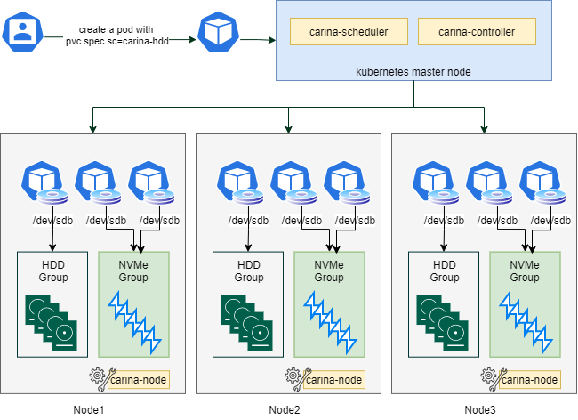

#### Carina

Carina是一套基于Kubernetes CSI标准实现的存储插件，用户可以使用标准的storageClass/PVC/PV原语申请carina提供的存储介质；Carina是一套云原生的存储插件，完全基于Kubernetes进行安装。它包含三个主要组件：carina-scheduler、carin-controller及carina-node，全部一容器化形势运行在Kubernetes中，并且占用极少的资源。

#### 支持环境

- Kubernetes：1.20 1.19 1.18
- Node OS：Linux
- Filesystems：ext4，xfs

#### Carina architecture

#### 组件介绍

​    如上图架构所示，carina能够自动发现本地裸盘，并根据其磁盘特性划分为hdd磁盘卷组及ssd磁盘卷组等，针对于本地数据高可用，carina推出了基于bcache的磁盘缓存功能以及自动组建RAID功能

- carina-node是运行在每个节点上的agent服务，利用lvm技术管理本地磁盘，按照类别将本地磁盘划分到不同的VG中，并从中划分LV提供给Pod使用。
- carina-scheduler是Kubernetes的调度插件，负责基于申请的PV大小、节点剩余磁盘空间大小，节点负载使用情况进行合理的调度。默认提供了spreadout及binpack两种调度策略
- carina-controller是carina的控制平面，监听PVC等资源，维护PVC、LV之间的关系

#### 功能列表

| Carina功能 | 是否支持 |
| ---------- | -------- |
| 动态pv     | 支持     |
| 文件存储   | 支持     |
| 块存储     | 支持     |
| 容量限制   | 支持     |
| 自动扩容   | 支持     |
| 快照       | 不支持   |
| 拓扑       | 支持     |

#### 开始

- 进入部署目录`cd deploy/kubernetes` 执行 `./deploy.sh`进行部署，`./deploy.sh uninstall`进行卸载
- 详细部署及使用参考`docs/使用手册.md`

#### 文档

- 请查看docs目录下设计及使用文档

